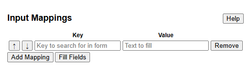

# QuikFill

Easily and quickly fill forms with pre-written information. QuikFill lets
you save a mapping of a Key, such as Address, and a Value associated with
the key. When you ask QuikFill to fill fields, it will look for all inputs
that may be associated with the key and fill it with the value you gave.

Compared to other similar extensions, QuikFill does not restrict you to
only certain websites or require you to have previously visited the website.
It seeks to to offer convenience even when when filling an unknown form.

## Getting Started

Install QuikFill from the Chrome Web Store, and click on it's extension logo.
You will see it's interface.

Here is a overview of all features:

1. Key/Value: QuikFill works by scanning the page you are currently on for
a input box labelled with the text you put in "Key". If found, QuikFill will
fill in that input box with the text you put in "Value". One key-value is
called a mapping. Your mappings are automatically saved locally.

2. Remove: Removes the mapping next to the button.

3. Up/Down Arrows: Move the the mappings next to the button up or down, changing the
order of the mappings.

4. Add Mapping: Makes a new empty mapping for you to add more mappings.

5. Fill Fields: Scans the page you are currently on and fills in values as
described in Key/Value. The scanning for keys is non-case sensitive, and does
not require exact matches. e.g. "Address Line 1" on the form would match the
key "Address". Already filled in input boxes are ignored. The entire document is
scanned to see if it matches key 1, followed by key 2 and so on. Thus,
one key may fill multiple input boxes on any given page.

> Note: Given that QuikFill is working with forms from websites it does
not have knowledge of, it may not work on all websites.

